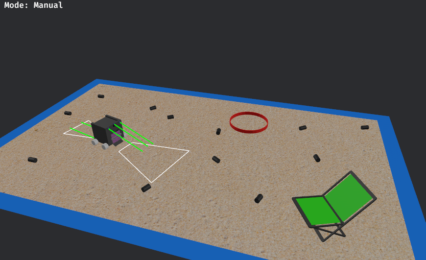
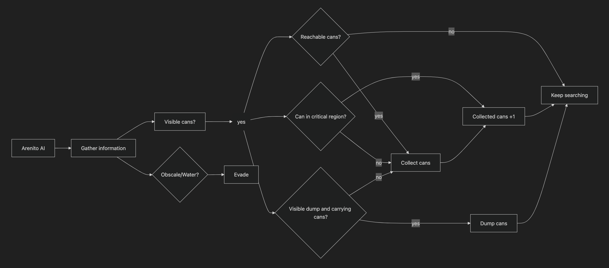
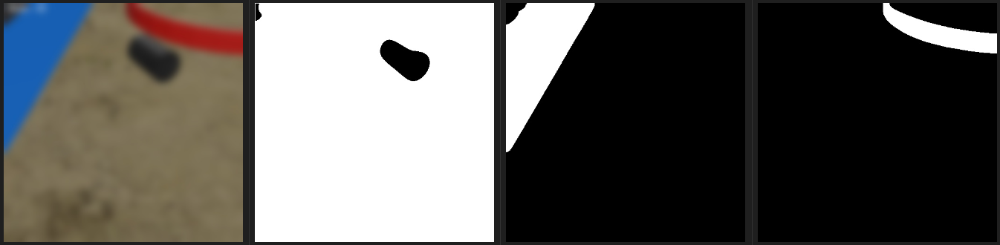
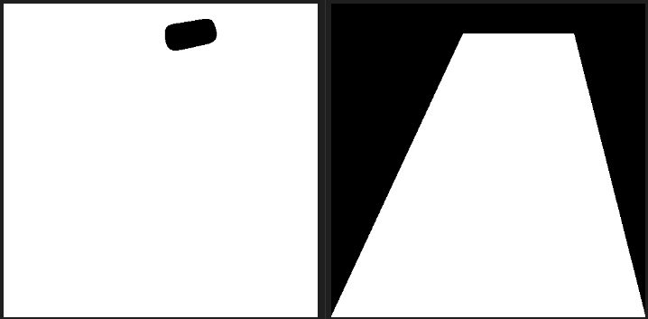
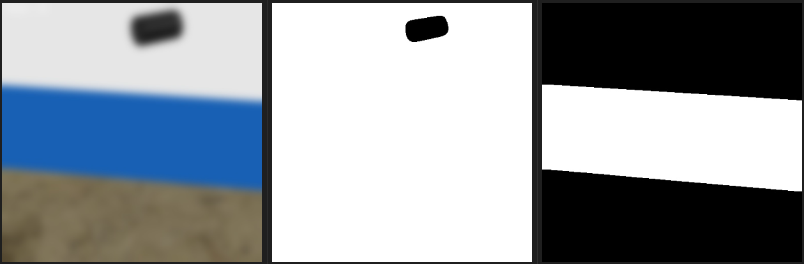
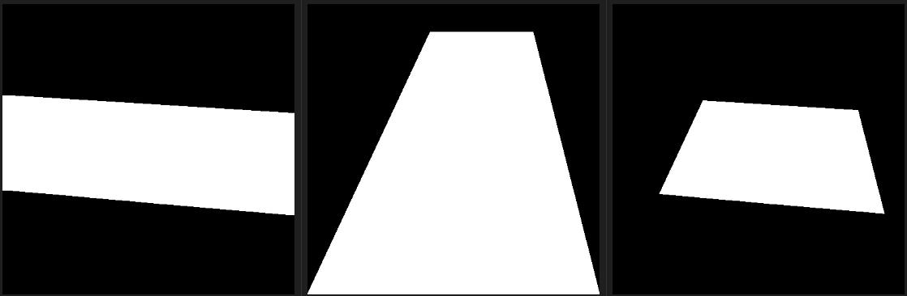
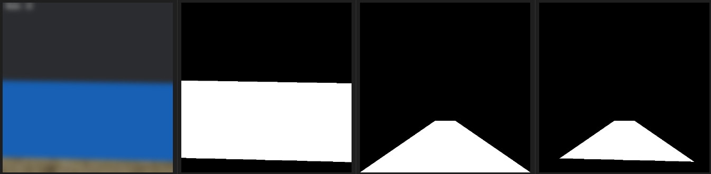

# Arenito 5.0

Una versión mejorada de Arenito, ganador del primer lugar en el TMR 2024.

# Simulación

Antes de tener el robot físico y probar cosas con éste, se creó una herramienta que permite desarrollar la IA sin la necesidad de un robot. Es una aplicación independiente que emula sensores y al mismo Arenito en un entorno virtual y que **tiene comunicación directa con la IA**.

<!-- Imgen de la simulación -->

Este último punto fue el foco principal: La simulación y el robot real usan las mismas *rutinas* y siguen el mismo *tren de pensamiento*.

# Inteligencia Artificial

La inteligencia artificial de Arenito es un modelo reactivo que reacciona según lo que vea la cámara (latas, depósito, agua) y los obstáculos que detecten los sensores de proximidad. Y sigue las siguientes reglas:

<!-- Diagrama de flujo de algoritmo general -->

Una explicación sobre la región crítica se da en esta sección: [IA: Relcolección de latas](#ia-recolección-de-latas)

La IA está dividia en tres módulos:
- Toma de decisiones [**[arenito_ai.py](ai/arenito_ai.py)**]: Acomodarse con el depósito, esquivar agua, recoger lata, etc.
- Análisis de imágenes [**[arenito_vision.py](ai/arenito_vision.py)**]: Detectar depósito, latas, agua, determinar si puede llegar a dichas detecciones.
- Comunicación [**[arenito_com.py](ai/arenito_com.py)**]: Mandar instrucciones a arduino/simulación, leer sensores.

## IA: Reconocimiento del entorno

Lo primero que hace Arenito antes de moverse es **recopilar información de su entorno**: tomar una imagen de lo que tiene en frente y distinguir los diferentes elementos visibles y leer sensores de proximidad.

Para distinguir diferentes elementos aplica filtros de color: negro para las latas, rojo para el depósito y azul para el agua. Los valores concretos de los filtros se encuentran en **[arenito_vision.py](ai/arenito_vision.py)**.

<!-- Imagen comparativa: filtros de color -->

El resultado de aplicar un filtro es una matriz binaria del mismo tamaño de la imagen original (512x512) que tiene `1` donde hay pixeles del color a filtrar y `0` en todo lo demás.

Con las matrices resultado de filtro (filtros) se determinan las acciones posibles para cada situación: Cuando el robot ve latas, cuando ve el depósito, cuando ve agua y todas las combinaciones de estas.

Las latas y el depósito se consideran **objetivos potencialmente alcanzables** y, antes de tomar una decisión, se debe determinar si son o no realmente alcanzables. Esto se hace con otra matriz binaria en la cual se dibuja el camino a recorrer hasta el objetivo.

<!-- Imagen comparativa: original, filtro negro, filtro rojo, camino hasta lata -->

Se dice que una lata es alcanzable cuando la intersección entre los filtros azul y rojo con el camino hasta la detección resulta en una matriz cuya cantidad de `1` no supera el umbral respectivo de azul y rojo. Cuando se determina si el depósito es alcanzable no se considera el filtro rojo.

Considere el siguiente caso (derecha). Los filtros de color relevantes son el negro (centro) y azul (derecha)

Al crear el camino para llegar a la lata (centro) e intersectarlo con el filtro azul (izquierda) se obtiene una figura (derecha), con la cual se determina que la lata no es alcanzable.

<!-- Imagen comparativa: filtro rojo, filtro azul, camino hasta lata, intersección azul, intersección rojo -->

Otra situación común es cuando el robot no ve ningún objetivo. En este caso buscará seguir avanzando hasta que el agua, el depósito o un obstáculo se lo impida. La manera en que determina esto es con el mismo método mencionado anteriormente, pero imaginando un objetivo directamente en frente. Si no puede alcanzar el objetivo imaginario, girará hacia algún lado, hasta que sí pueda avanzar.

<!-- Imagen comparativa: original en borde, filtro rojo, filtro azul, camino hasta objetivo imaginario, intersección rojo, intersección azul -->

## IA: Recolección de latas

Para determinar si recogió una lata se implementó una región crítica. Se registra caundo una lata está dentro de la región crítica y cuando deja de ser visible, entonces se considera que la recogió. Dicha región crítica está delimitada por el *rectángulo negro*.

<!-- Imagen simulación mostrando campo de visión, imagen procesada con lata dentro de región crítica, imagen después de lata en región crítica -->

<!-- NOTAS:
- El robot solo usa la cámara y sensores traseros para acomodarse con el depósito.
- CV2 almacena imágenes en formato BGR, ese es el formato que se usa al aplicar los filtros. -->
