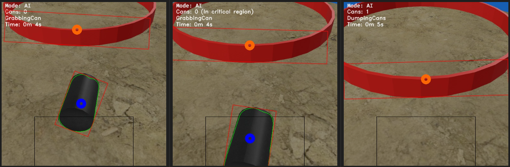

# Arenito 5.0

The improved Arenito – 1st place winner of the 2024 Mexican Robotics Tournament.

# Simulation

A simulation was developed prior to hardware deployment. It enabled early development of the robot’s AI. The simulation is an independent application that emulates Arenito and its sensors in a virtual environment, communicating directly with the AI through shared memory.

# Artificial Intelligence

Arenito's artificial intelligence makes decisions based on what the camera detects (cans, dump zone, water) and proximity sensor data.

An explanation of the critical region is provided in this section: [IA: Recolección de latas](#ia-recolección-de-latas)

The AI is divided into three modules:
- Decision-making [**[arenito_ai.py](ai/arenito_ai.py)**]: Align with the dump zone, avoid water, collect cans, etc.
- Image analysis [**[arenito_vision.py](ai/arenito_vision.py)**]: Detect the dump zone, cans, water, and assess reachability.
- Communication [**[arenito_com.py](ai/arenito_com.py)**]: Send instructions to the Arduino/simulator, and read sensors.

## AI: Environmental Awareness

Before moving, the robot first **gathers information about its environment**: it captures an image of what’s ahead and identifies visible elements, along with reading proximity sensor data.

It distinguishes elements using color filters: black for cans, red for the dump zone, and blue for water. The exact filter values can be found in **[arenito_vision.py](ai/arenito_vision.py)**.

The output of each filter is a binary matrix of the same dimensions as the original image (512x512), where pixels matching the target color are marked with `1`, and everything else is `0`.

Cans and the dump zone are considered **potentially reachable targets**. To determine if a target is actually reachable, the AI creates another binary mask that represents a path (typically a trapezoid) from the robot’s position to the target.

A can is considered reachable if the intersection between the blue and red filters and the path mask results in a region smaller than a defined threshold. These filters are evaluated separately.

Consider the following case:

Here, a can is detected outside the arena. When a path to the can is drawn (middle) and intersected with the blue filter (right), the resulting area exceeds the threshold, so the can is deemed unreachable.

Another common situation occurs when no targets are visible. In this case, the robot will attempt to move forward unless water, the dump zone, or an obstacle blocks the path. To check this, it imagines a virtual target directly ahead and evaluates reachability as usual. If it can't reach the imagined target, it turns until a clear path is found.

## AI: Can Collection

To detect when a can has been collected, a **critical region** is defined. If a can enters this region and then disappears from view, it is assumed to have been picked up. This region is marked with a black rectangle in the image.

<!-- NOTES:
- The robot only uses the camera and rear sensors when aligning with the dump zone.
- OpenCV stores images in BGR format, which is the format used when applying the color filters. -->
